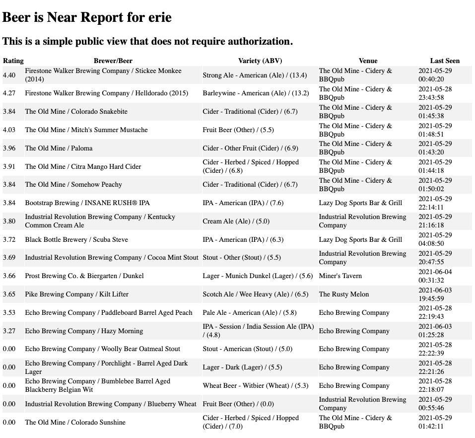

# Beer Server API documentation (NOT COMPLETE)
The beer server application provides access to information on beers (venues, breweries, ratings, ABV, and more)in certain localities.  It utilizes the untappd api.

This is a REST API that returns encoded JSON responses and uses standard HTTP response codes (success and error codes) and verbs (GET, POST, and DELETE).  You may create, retrieve, and delete API objects through this simple interface.  
>Note:  Update of API objects is not currently supported.
This documentation will take you through each end point providing the following information:  

- Endpoint description
- A sample curl statement to call the endpoint with necessary parameters
- Returned encoded JSON response

It is a REST API that returns 
## General Information

### Base URL
This project has been deployed on HEROKU at the following address:   `[https://capstone-nearbeer-app.herokuapp.com/](https://capstone-nearbeer-app.herokuapp.com/)` 

The backend is hosted locally at the following default development address:

http://localhost:5000

http://127.0.0.1:5000


## Error handling - HTTP error codes

HTTP status/error codes and messages. This API returns the following status codes. Supported status and error handling includes 200 for successful requests and 4xx error codes for malformed requests to resource not available events.

Attributes

- success: Boolean. Returns False for all error codes.
- error: HTTP status code
- message: Human readable message with details about the error
  
### Status and Error codes

- 200 "OK": request was succesful.
  - response: varies, see documentation for specific endpoint

- 422 "unprocessable": request was not valid or server could not process the request

  - response
  ```json 
    {
        "success": False, 
        "error": 422,
        "message": "unprocessable"
    }
    ```

- 404 "resource not found": request was valid but the resouce was not found

  - response
  ```json
    {
    "success": False, 
    "error": 404,
    "message": "resource not found"
    }
  ```

- 400 "bad request": request was not formatted correctly

  - response
  ```json
    {
    "success": False, 
    "error": 400,
    "message": "bad request"
    }
   ```

- 405 "method not allowed": request specified unsupported method for request

  - response
  ```json
    {
    "success": False, 
    "error": 405,
    "message": "method not all0wed"
    }
  ```

- 500 "Internal Server Error": The server encountered an unexpected condition which prevented it from fulfilling the request.

  - response
  ```json
    {
    "success": False, 
    "error": 500,
    "message": "internal server error"
    }
  ```

- AuthError Generic error handler for Auth0 authorization error - returned by auth.py api

 - response
```json
    {
        "success": False,
        "error": error code returned by auth.py api
        "message": error message returned by auth.py api
    }
```
 

### AUTH0 ROLE BASED Authentication/access control necessary to access endpoints

Role: Brewer  
Description: Admin for Near Beer site.  Able to view/add/delete/update beers, styles, user ratings
Permissions:

- get:beer-details	Retrieve info for one beer
- get:beers	Retrieve list of beers
- get:styles	Retrieve list of beer styles
- patch:beer-user-rating	Update user rating for one beer
- post:beers	Add a new beer	
- view:simple	Simple table view for admin use


Role: Beer-lover  
Description: Beer enthusiast can view beers and update user ratings on beers.
Permissions: 

- get:beer-details	Retrieve info for one beer	
- get:beers	Retrieve list of beers
- patch:beer-user-rating	Update user rating for one beer 

For simplification the term {valid JWT} will replace actual JSON Web Token (JWT) in example curl commands below. 

Sample JWT:
```json
eyJhbGciOiJSUzI1NiIsInR5cCI6IkpXVCIsImtpZCI6IldIdHhPZnhSeUZTYWw1TTJjN2lPeSJ9.eyJpc3MiOiJodHRwczovL3Byb2R1Y3QtZGVtb3MudXMuYXV0aDAuY29tLyIsInN1YiI6ImF1dGgwfDYwZTg4NWJlNTMwODA5MDA2OGZmZjU0MiIsImF1ZCI6WyJiZWVybmVhciIsImh0dHBzOi8vcHJvZHVjdC1kZW1vcy51cy5hdXRoMC5jb20vdXNlcmluZm8iXSwiaWF0IjoxNjMzNTIyMDIyLCJleHAiOjE2MzM2MDg0MjIsImF6cCI6InppUjNDdXczU1dtRmhrUFdmVGhGOUxEejdna1huTUg2Iiwic2NvcGUiOiJvcGVuaWQgcHJvZmlsZSBlbWFpbCIsInBlcm1pc3Npb25zIjpbImRlbGV0ZTpiZWVycyIsImdldDpiZWVyLWRldGFpbHMiLCJnZXQ6YmVlcnMiLCJnZXQ6c3R5bGVzIiwicGF0Y2g6YmVlci11c2VyLXJhdGluZyIsInBvc3Q6YmVlcnMiLCJ2aWV3OnNpbXBsZSJdfQ.ZrzhVG5hO_1MviO4H759eUBzMCQkH7CttOKzXhqa00y9lDpwTjn9lJ-gRV5wnZcQSLXdmHHdgYAFQEqPI9aYuX-yjt3zClynk8WyQ7eaVTxaiEoOwCUXQ6ikh0TJcknT0FagHXU1BNb2mNx67UMX0hML4kYz1GG4KZrezBF2L1vQDCD036UD0PCE5ee0X2-mxKHo0h8xvbjIQm2IcUz20NhtrAchxs-f5SF3oxRsAT75rBlM8soLnbe6iYAaW-ojf3BSyDwFaV85H6-J93-RhBA15hUNN-VwZHTtk3ot4kmBypiemq58Q0rkrJx5R57N-Ol8Sqmd0UDz7JIzp_X_Ow
```

## Endpoints

### GET beers/template  
Retrieves a listing of beers for given city / no authorization 

- curl command
```bash
curl -X GET  'http://localhost:5000/beers/template?city=erie'
```
- Response is jinja2 template:



```html

<!DOCTYPE html>
<html>
  <head>
    <title>Beer is Near Report - erie</title>
    <style>
       tr:nth-child(even) {background-color: #f2f2f2;}
       th:hover {
         background-color: yellow;
         cursor: pointer;
      }
    </style>
    <link rel="stylesheet" href="/static/index.css">
    <link rel="shortcut icon" href="/static/favicon.ico">
  </head>
  <body>
    <h1>Beer is Near Report for erie</h1>
    <h2>This is a simple public view that does not require authorization.</h2>
    <table id="beerListTable"style="width:100%">
      <!-- <tr> 
        <th onclick="sortTable(0)">Rating</th>
        <th onclick="sortTable(1)">Brewery</th>
        <th onclick="sortTable(2)">Beer</th>
        <th onclick="sortTable(3)">Variety</th>
        <th onclick="sortTable(4)">Venue</th>
        <th onclick="sortTable(5)">ABV</th>
        <th onclick="sortTable(6)">Last Seen</th>
      </tr> -->

      <tr> 
        <th onclick="sortTable(0)">Rating</th>
        <th onclick="sortTable(1)">Brewer/Beer</th>
        <th>Variety (ABV)</th>
        <th onclick="sortTable(4)">Venue</th>
        <th onclick="sortTable(6)">Last Seen</th>
      </tr> 
      
          <tr>
            <td>4.40</td>
            <td>Firestone Walker Brewing Company / Stickee Monkee (2014)</td>
            <td>Strong Ale - American (Ale) / (13.4)</td>
            <td>The Old Mine - Cidery &amp; BBQpub</td>
            <td>2021-05-29 00:40:20</td>
          </tr>
      
          <tr>
            <td>4.27</td>
            <td>Firestone Walker Brewing Company / Helldorado (2015)</td>
            <td>Barleywine - American (Ale) / (13.2)</td>
            <td>The Old Mine - Cidery &amp; BBQpub</td>
            <td>2021-05-28 23:43:58</td>
          </tr>
      
          <tr>
            <td>3.84</td>
            <td>The Old Mine / Colorado Snakebite</td>
            <td>Cider - Traditional (Cider) / (6.7)</td>
            <td>The Old Mine - Cidery &amp; BBQpub</td>
            <td>2021-05-29 01:45:38</td>
          </tr>
      
          <tr>
            <td>4.03</td>
            <td>The Old Mine / Mitch&#39;s Summer Mustache</td>
            <td>Fruit Beer (Other) / (5.5)</td>
            <td>The Old Mine - Cidery &amp; BBQpub</td>
            <td>2021-05-29 01:48:51</td>
          </tr>
      
          <tr>
            <td>3.96</td>
            <td>The Old Mine / Paloma</td>
            <td>Cider - Other Fruit (Cider) / (6.9)</td>
            <td>The Old Mine - Cidery &amp; BBQpub</td>
            <td>2021-05-29 01:43:20</td>
          </tr>
      
          <tr>
            <td>3.91</td>
            <td>The Old Mine / Citra Mango Hard Cider</td>
            <td>Cider - Herbed / Spiced / Hopped (Cider) / (6.8)</td>
            <td>The Old Mine - Cidery &amp; BBQpub</td>
            <td>2021-05-29 01:44:18</td>
          </tr>
      
          <tr>
            <td>3.84</td>
            <td>The Old Mine / Somehow Peachy</td>
            <td>Cider - Traditional (Cider) / (6.7)</td>
            <td>The Old Mine - Cidery &amp; BBQpub</td>
            <td>2021-05-29 01:50:02</td>
          </tr>
      
          <tr>
            <td>3.84</td>
            <td>Bootstrap Brewing / INSANE RUSH® IPA</td>
            <td>IPA - American (IPA) / (7.6)</td>
            <td>Lazy Dog Sports Bar &amp; Grill</td>
            <td>2021-05-29 22:14:11</td>
          </tr>
      
          <tr>
            <td>3.80</td>
            <td>Industrial Revolution Brewing Company / Kentucky Common Cream Ale</td>
            <td>Cream Ale (Ale) / (5.0)</td>
            <td>Industrial Revolution Brewing Company</td>
            <td>2021-05-29 21:16:18</td>
          </tr>
      
          <tr>
            <td>3.72</td>
            <td>Black Bottle Brewery / Scuba Steve</td>
            <td>IPA - American (IPA) / (6.3)</td>
            <td>Lazy Dog Sports Bar &amp; Grill</td>
            <td>2021-05-29 04:08:50</td>
          </tr>
      
          <tr>
            <td>3.69</td>
            <td>Industrial Revolution Brewing Company / Cocoa Mint Stout</td>
            <td>Stout - Other (Stout) / (5.5)</td>
            <td>Industrial Revolution Brewing Company</td>
            <td>2021-05-29 20:47:55</td>
          </tr>
      
          <tr>
            <td>3.66</td>
            <td>Prost Brewing Co. &amp; Biergarten / Dunkel</td>
            <td>Lager - Munich Dunkel (Lager) / (5.6)</td>
            <td>Miner&#39;s Tavern</td>
            <td>2021-06-04 00:31:32</td>
          </tr>
      
          <tr>
            <td>3.65</td>
            <td>Pike Brewing Company / Kilt Lifter</td>
            <td>Scotch Ale / Wee Heavy (Ale) / (6.5)</td>
            <td>The Rusty Melon</td>
            <td>2021-06-03 19:45:59</td>
          </tr>
      
          <tr>
            <td>3.53</td>
            <td>Echo Brewing Company / Paddleboard Barrel Aged Peach</td>
            <td>Pale Ale - American (Ale) / (5.8)</td>
            <td>Echo Brewing Company</td>
            <td>2021-05-28 22:19:43</td>
          </tr>
      
          <tr>
            <td>3.27</td>
            <td>Echo Brewing Company / Hazy Morning</td>
            <td>IPA - Session / India Session Ale (IPA) / (4.8)</td>
            <td>Echo Brewing Company</td>
            <td>2021-06-03 01:25:28</td>
          </tr>
      
          <tr>
            <td>0.00</td>
            <td>Echo Brewing Company / Woolly Bear Oatmeal Stout</td>
            <td>Stout - American (Stout) / (5.0)</td>
            <td>Echo Brewing Company</td>
            <td>2021-05-28 22:22:39</td>
          </tr>
      
          <tr>
            <td>0.00</td>
            <td>Echo Brewing Company / Porchlight - Barrel Aged Dark Lager</td>
            <td>Lager - Dark (Lager) / (5.5)</td>
            <td>Echo Brewing Company</td>
            <td>2021-05-28 22:21:26</td>
          </tr>
      
          <tr>
            <td>0.00</td>
            <td>Echo Brewing Company / Bumblebee Barrel Aged Blackberry Belgian Wit</td>
            <td>Wheat Beer - Witbier (Wheat) / (5.3)</td>
            <td>Echo Brewing Company</td>
            <td>2021-05-28 22:18:07</td>
          </tr>
      
          <tr>
            <td>0.00</td>
            <td>Industrial Revolution Brewing Company / Blueberry Wheat</td>
            <td>Fruit Beer (Other) / (0.0)</td>
            <td>Industrial Revolution Brewing Company</td>
            <td>2021-05-29 00:55:46</td>
          </tr>
      
          <tr>
            <td>0.00</td>
            <td>The Old Mine / Colorado Sunshine</td>
            <td>Cider - Herbed / Spiced / Hopped (Cider) / (7.0)</td>
            <td>The Old Mine - Cidery &amp; BBQpub</td>
            <td>2021-05-29 01:42:11</td>
          </tr>
      
    </table> 
    
  </body>
</html>
```


### GET /beers  
Retrieves of listing of beers for given city.  Returns json / no authorization

- curl command
  
```bash
curl -X GET  'http://localhost:5000/beers?city=lyons'
```
- Response is json
```json
{
  "beer_count": 8, 
  "beers": [
    {
      "abv": "6.3", 
      "bid": "2575009", 
      "brewery_name": "Bootstrap Brewing", 
      "brewery_slug": "bootstrap-brewing", 
      "id": "230", 
      "last_seen": "2021-05-31 01:01:13", 
      "major_style": "IPA", 
      "name": "LUSH PUPPY Juicy IPA", 
      "rating": "3.89", 
      "slug": "bootstrap-brewing-lush-puppy-juicy-ipa", 
      "style": "IPA - New England", 
      "url": "https://untappd.com/b/bootstrap-brewingbootstrap-brewing-lush-puppy-juicy-ipa/2575009", 
      "user_rating": "0.00", 
      "venue": {
        "address": "303 Main St", 
        "blob": null, 
        "city": "Lyons", 
        "country": "United States", 
        "id": 38, 
        "lat": "40.2243000", 
        "lng": "-105.2690000", 
        "name": "Oskar Blues Grill & Brew", 
        "slug": "oskar-blues-grill-brew", 
        "state": "CO", 
        "venue_id": "20118"
      }, 
      "venue_id": "20118"
    }, 
    {
      "abv": "8.7", 
      "bid": "32167", 
      "brewery_name": "Oskar Blues Brewery", 
      "brewery_slug": "oskar-blues-brewery", 
      "id": "255", 
      "last_seen": "2021-05-31 21:16:20", 
      "major_style": "IPA", 
      "name": "G'Knight", 
      "rating": "3.85", 
      "slug": "oskar-blues-brewery-g-knight", 
      "style": "IPA - Red", 
      "url": "https://untappd.com/b/oskar-blues-breweryoskar-blues-brewery-g-knight/32167", 
      "user_rating": "0.00", 
      "venue": {
        "address": "303 Main St", 
        "blob": null, 
        "city": "Lyons", 
        "country": "United States", 
        "id": 38, 
        "lat": "40.2243000", 
        "lng": "-105.2690000", 
        "name": "Oskar Blues Grill & Brew", 
        "slug": "oskar-blues-grill-brew", 
        "state": "CO", 
        "venue_id": "20118"
      }, 
      "venue_id": "20118"
    }, 
    {
      "abv": "7.2", 
      "bid": "3209727", 
      "brewery_name": "Oskar Blues Brewery", 
      "brewery_slug": "oskar-blues-brewery", 
      "id": "395", 
      "last_seen": "2021-06-03 17:25:22", 
      "major_style": "IPA", 
      "name": "Can-O-Bliss Hazy IPA", 
      "rating": "3.75", 
      "slug": "oskar-blues-brewery-can-o-bliss-hazy-ipa", 
      "style": "IPA - New England", 
      "url": "https://untappd.com/b/oskar-blues-breweryoskar-blues-brewery-can-o-bliss-hazy-ipa/3209727", 
      "user_rating": "0.00", 
      "venue": {
        "address": "303 Main St", 
        "blob": null, 
        "city": "Lyons", 
        "country": "United States", 
        "id": 38, 
        "lat": "40.2243000", 
        "lng": "-105.2690000", 
        "name": "Oskar Blues Grill & Brew", 
        "slug": "oskar-blues-grill-brew", 
        "state": "CO", 
        "venue_id": "20118"
      }, 
      "venue_id": "20118"
    }, 
    {
      "abv": "8.0", 
      "bid": "4743", 
      "brewery_name": "Oskar Blues Brewery", 
      "brewery_slug": "oskar-blues-brewery", 
      "id": "422", 
      "last_seen": "2021-05-31 01:03:04", 
      "major_style": "Ale", 
      "name": "Old Chub", 
      "rating": "3.74", 
      "slug": "oskar-blues-brewery-old-chub", 
      "style": "Scotch Ale / Wee Heavy", 
      "url": "https://untappd.com/b/oskar-blues-breweryoskar-blues-brewery-old-chub/4743", 
      "user_rating": "0.00", 
      "venue": {
        "address": "303 Main St", 
        "blob": null, 
        "city": "Lyons", 
        "country": "United States", 
        "id": 38, 
        "lat": "40.2243000", 
        "lng": "-105.2690000", 
        "name": "Oskar Blues Grill & Brew", 
        "slug": "oskar-blues-grill-brew", 
        "state": "CO", 
        "venue_id": "20118"
      }, 
      "venue_id": "20118"
    }, 
    {
      "abv": "4.5", 
      "bid": "280742", 
      "brewery_name": "Bootstrap Brewing", 
      "brewery_slug": "bootstrap-brewing", 
      "id": "507", 
      "last_seen": "2021-05-28 21:28:28", 
      "major_style": "Other", 
      "name": "CHILLAX\u00ae Pineapple Gold", 
      "rating": "3.66", 
      "slug": "bootstrap-brewing-chillax-pineapple-gold", 
      "style": "Fruit Beer", 
      "url": "https://untappd.com/b/bootstrap-brewingbootstrap-brewing-chillax-pineapple-gold/280742", 
      "user_rating": "0.00", 
      "venue": {
        "address": "303 Main St", 
        "blob": null, 
        "city": "Lyons", 
        "country": "United States", 
        "id": 38, 
        "lat": "40.2243000", 
        "lng": "-105.2690000", 
        "name": "Oskar Blues Grill & Brew", 
        "slug": "oskar-blues-grill-brew", 
        "state": "CO", 
        "venue_id": "20118"
      }, 
      "venue_id": "20118"
    }, 
    {
      "abv": "6.5", 
      "bid": "10759", 
      "brewery_name": "Oskar Blues Brewery", 
      "brewery_slug": "oskar-blues-brewery", 
      "id": "549", 
      "last_seen": "2021-06-01 18:41:48", 
      "major_style": "Ale", 
      "name": "Dale's Pale Ale", 
      "rating": "3.64", 
      "slug": "oskar-blues-brewery-dale-s-pale-ale", 
      "style": "Pale Ale - American", 
      "url": "https://untappd.com/b/oskar-blues-breweryoskar-blues-brewery-dale-s-pale-ale/10759", 
      "user_rating": "0.00", 
      "venue": {
        "address": "303 Main St", 
        "blob": null, 
        "city": "Lyons", 
        "country": "United States", 
        "id": 38, 
        "lat": "40.2243000", 
        "lng": "-105.2690000", 
        "name": "Oskar Blues Grill & Brew", 
        "slug": "oskar-blues-grill-brew", 
        "state": "CO", 
        "venue_id": "20118"
      }, 
      "venue_id": "20118"
    }, 
    {
      "abv": "4.7", 
      "bid": "5210", 
      "brewery_name": "Oskar Blues Brewery", 
      "brewery_slug": "oskar-blues-brewery", 
      "id": "708", 
      "last_seen": "2021-05-31 21:13:33", 
      "major_style": "Lager", 
      "name": "Mama's Little Yella Pils", 
      "rating": "3.44", 
      "slug": "oskar-blues-brewery-mama-s-little-yella-pils", 
      "style": "Pilsner - Czech", 
      "url": "https://untappd.com/b/oskar-blues-breweryoskar-blues-brewery-mama-s-little-yella-pils/5210", 
      "user_rating": "0.00", 
      "venue": {
        "address": "303 Main St", 
        "blob": null, 
        "city": "Lyons", 
        "country": "United States", 
        "id": 38, 
        "lat": "40.2243000", 
        "lng": "-105.2690000", 
        "name": "Oskar Blues Grill & Brew", 
        "slug": "oskar-blues-grill-brew", 
        "state": "CO", 
        "venue_id": "20118"
      }, 
      "venue_id": "20118"
    }, 
    {
      "abv": "5.0", 
      "bid": "3833", 
      "brewery_name": "Coors Brewing Company", 
      "brewery_slug": "coors-brewing-company", 
      "id": "761", 
      "last_seen": "2021-05-29 22:46:01", 
      "major_style": "Lager", 
      "name": "Coors Banquet", 
      "rating": "2.77", 
      "slug": "coors-brewing-company-coors-banquet", 
      "style": "Lager - American", 
      "url": "https://untappd.com/b/coors-brewing-companycoors-brewing-company-coors-banquet/3833", 
      "user_rating": "0.00", 
      "venue": {
        "address": "", 
        "blob": null, 
        "city": "Lyons", 
        "country": "United States", 
        "id": 5, 
        "lat": "40.2284000", 
        "lng": "-105.2740000", 
        "name": "Planet Bluegrass", 
        "slug": "planet-bluegrass", 
        "state": "CO", 
        "venue_id": "104541"
      }, 
      "venue_id": "104541"
    }
  ], 
  "current_city": "lyons", 
  "status_code": 200, 
  "success": true
```

### GET /
Retrives listing of all beers.  Returns json.  Requires authorization.
  
- curl command
  
```bash
curl -X GET  'http://localhost:5000/' -H 'authorization: Bearer '{valid JWT}'
```
- Response is json

```json
{
  "beer_count": 986, 
  "beers": [
    {
      "abv": "8.1", 
      "bid": "223937", 
      "brewery_name": "Gravity Brewing", 
      "brewery_slug": "gravity-brewing", 
      "id": 502, 
      "last_seen": "Sat, 29 May 2021 01:42:24 GMT", 
      "major_style": "Other", 
      "name": "Mendacious", 
      "rating": "3.67", 
      "style": "Belgian Blonde", 
      "url": "https://untappd.com/b/gravity-brewinggravity-brewing-mendacious/223937", 
      "user_rating": "0.00", 
      "venue_id": "368276"
    }, 
    {
      "abv": "0.0", 
      "bid": "4260081", 
      "brewery_name": "12Degree Brewing", 
      "brewery_slug": "12degree-brewing", 
      "id": 795, 
      "last_seen": "Sun, 30 May 2021 01:39:35 GMT", 
      "major_style": "IPA", 
      "name": "Lars", 
      "rating": "0.00", 
      "style": "IPA - International", 
      "url": "https://untappd.com/b/12degree-brewing12degree-brewing-lars/4260081", 
      "user_rating": "0.00", 
      "venue_id": "823668"
    }, 
    .
    .
    .
    {
      "abv": "5.3", 
      "bid": "4152636", 
      "brewery_name": "Cellar West Artisan Ales", 
      "brewery_slug": "cellar-west-artisan-ales", 
      "id": 983, 
      "last_seen": "Fri, 04 Jun 2021 02:35:46 GMT", 
      "major_style": "Ale", 
      "name": "Terra Australis", 
      "rating": "0.00", 
      "style": "Farmhouse Ale - Saison", 
      "url": "https://untappd.com/b/cellar-west-artisan-alescellar-west-artisan-ales-terra-australis/4152636", 
      "user_rating": "0.00", 
      "venue_id": "8500683"
    }, 
    {
      "abv": "7.0", 
      "bid": "4328165", 
      "brewery_name": "Oskar Blues Brewery", 
      "brewery_slug": "oskar-blues-brewery", 
      "id": 984, 
      "last_seen": "Fri, 04 Jun 2021 19:11:49 GMT", 
      "major_style": "Wheat", 
      "name": "Lost Grog Tiki Wheat", 
      "rating": "0.00", 
      "style": "Wheat Beer - Other", 
      "url": "https://untappd.com/b/oskar-blues-breweryoskar-blues-brewery-lost-grog-tiki-wheat/4328165", 
      "user_rating": "0.00", 
      "venue_id": "6750760"
    }, 
    {
      "abv": "5.5", 
      "bid": "4214621", 
      "brewery_name": "Odd13 Brewing", 
      "brewery_slug": "odd13-brewing", 
      "id": 985, 
      "last_seen": "Fri, 04 Jun 2021 19:00:43 GMT", 
      "major_style": "Lager", 
      "name": "Citrico Bombadero", 
      "rating": "0.00", 
      "style": "Lager - American Light", 
      "url": "https://untappd.com/b/odd13-brewingodd13-brewing-citrico-bombadero/4214621", 
      "user_rating": "0.00", 
      "venue_id": "920005"
    }, 
    {
      "abv": "7.2", 
      "bid": "4339955", 
      "brewery_name": "Oskar Blues Brewery", 
      "brewery_slug": "oskar-blues-brewery", 
      "id": 986, 
      "last_seen": "Fri, 04 Jun 2021 21:12:02 GMT", 
      "major_style": "IPA", 
      "name": "Can-O-Bliss Tiki", 
      "rating": "0.00", 
      "style": "IPA - International", 
      "url": "https://untappd.com/b/oskar-blues-breweryoskar-blues-brewery-can-o-bliss-tiki/4339955", 
      "user_rating": "0.00", 
      "venue_id": "6750760"
    }, 
    {
      "abv": "13.5", 
      "bid": "4317430", 
      "brewery_name": "Superstition Meadery", 
      "brewery_slug": "superstition-meadery", 
      "id": 1, 
      "last_seen": "Sun, 30 May 2021 04:22:59 GMT", 
      "major_style": "Mead", 
      "name": "Mulberry White", 
      "rating": "4.70", 
      "style": "Mead - Other", 
      "url": "https://untappd.com/b/superstition-meaderysuperstition-meadery-mulberry-white/4317430", 
      "user_rating": "4.25", 
      "venue_id": "5237140"
    }
  ], 
  "status_code": 200, 
  "success": true
}

```
### GET /beers/\<city\>/  
Retrieves listing of beers by city. Includes venue information.  Returns json.  Requires authorization.

- curl command
```bash
curl -X GET  'http://localhost:5000/beers/lyons/' -H 'authorization: Bearer '{valid JWT}'
```

- Response is json

```json
{
  "beer_count": 8, 
  "beers": [
    {
      "abv": "6.3", 
      "bid": "2575009", 
      "brewery_name": "Bootstrap Brewing", 
      "brewery_slug": "bootstrap-brewing", 
      "id": "230", 
      "last_seen": "2021-05-31 01:01:13", 
      "major_style": "IPA", 
      "name": "LUSH PUPPY Juicy IPA", 
      "rating": "3.89", 
      "slug": "bootstrap-brewing-lush-puppy-juicy-ipa", 
      "style": "IPA - New England", 
      "url": "https://untappd.com/b/bootstrap-brewingbootstrap-brewing-lush-puppy-juicy-ipa/2575009", 
      "user_rating": "0.00", 
      "venue": {
        "address": "303 Main St", 
        "blob": null, 
        "city": "Lyons", 
        "country": "United States", 
        "id": 38, 
        "lat": "40.2243000", 
        "lng": "-105.2690000", 
        "name": "Oskar Blues Grill & Brew", 
        "slug": "oskar-blues-grill-brew", 
        "state": "CO", 
        "venue_id": "20118"
      }, 
      "venue_id": "20118"
    }, 
    {
      "abv": "8.7", 
      "bid": "32167", 
      "brewery_name": "Oskar Blues Brewery", 
      "brewery_slug": "oskar-blues-brewery", 
      "id": "255", 
      "last_seen": "2021-05-31 21:16:20", 
      "major_style": "IPA", 
      "name": "G'Knight", 
      "rating": "3.85", 
      "slug": "oskar-blues-brewery-g-knight", 
      "style": "IPA - Red", 
      "url": "https://untappd.com/b/oskar-blues-breweryoskar-blues-brewery-g-knight/32167", 
      "user_rating": "0.00", 
      "venue": {
        "address": "303 Main St", 
        "blob": null, 
        "city": "Lyons", 
        "country": "United States", 
        "id": 38, 
        "lat": "40.2243000", 
        "lng": "-105.2690000", 
        "name": "Oskar Blues Grill & Brew", 
        "slug": "oskar-blues-grill-brew", 
        "state": "CO", 
        "venue_id": "20118"
      }, 
      "venue_id": "20118"
    }, 
    {
      "abv": "7.2", 
      "bid": "3209727", 
      "brewery_name": "Oskar Blues Brewery", 
      "brewery_slug": "oskar-blues-brewery", 
      "id": "395", 
      "last_seen": "2021-06-03 17:25:22", 
      "major_style": "IPA", 
      "name": "Can-O-Bliss Hazy IPA", 
      "rating": "3.75", 
      "slug": "oskar-blues-brewery-can-o-bliss-hazy-ipa", 
      "style": "IPA - New England", 
      "url": "https://untappd.com/b/oskar-blues-breweryoskar-blues-brewery-can-o-bliss-hazy-ipa/3209727", 
      "user_rating": "0.00", 
      "venue": {
        "address": "303 Main St", 
        "blob": null, 
        "city": "Lyons", 
        "country": "United States", 
        "id": 38, 
        "lat": "40.2243000", 
        "lng": "-105.2690000", 
        "name": "Oskar Blues Grill & Brew", 
        "slug": "oskar-blues-grill-brew", 
        "state": "CO", 
        "venue_id": "20118"
      }, 
      "venue_id": "20118"
    }, 
    {
      "abv": "8.0", 
      "bid": "4743", 
      "brewery_name": "Oskar Blues Brewery", 
      "brewery_slug": "oskar-blues-brewery", 
      "id": "422", 
      "last_seen": "2021-05-31 01:03:04", 
      "major_style": "Ale", 
      "name": "Old Chub", 
      "rating": "3.74", 
      "slug": "oskar-blues-brewery-old-chub", 
      "style": "Scotch Ale / Wee Heavy", 
      "url": "https://untappd.com/b/oskar-blues-breweryoskar-blues-brewery-old-chub/4743", 
      "user_rating": "0.00", 
      "venue": {
        "address": "303 Main St", 
        "blob": null, 
        "city": "Lyons", 
        "country": "United States", 
        "id": 38, 
        "lat": "40.2243000", 
        "lng": "-105.2690000", 
        "name": "Oskar Blues Grill & Brew", 
        "slug": "oskar-blues-grill-brew", 
        "state": "CO", 
        "venue_id": "20118"
      }, 
      "venue_id": "20118"
    }, 
    {
      "abv": "4.5", 
      "bid": "280742", 
      "brewery_name": "Bootstrap Brewing", 
      "brewery_slug": "bootstrap-brewing", 
      "id": "507", 
      "last_seen": "2021-05-28 21:28:28", 
      "major_style": "Other", 
      "name": "CHILLAX\u00ae Pineapple Gold", 
      "rating": "3.66", 
      "slug": "bootstrap-brewing-chillax-pineapple-gold", 
      "style": "Fruit Beer", 
      "url": "https://untappd.com/b/bootstrap-brewingbootstrap-brewing-chillax-pineapple-gold/280742", 
      "user_rating": "0.00", 
      "venue": {
        "address": "303 Main St", 
        "blob": null, 
        "city": "Lyons", 
        "country": "United States", 
        "id": 38, 
        "lat": "40.2243000", 
        "lng": "-105.2690000", 
        "name": "Oskar Blues Grill & Brew", 
        "slug": "oskar-blues-grill-brew", 
        "state": "CO", 
        "venue_id": "20118"
      }, 
      "venue_id": "20118"
    }, 
    {
      "abv": "6.5", 
      "bid": "10759", 
      "brewery_name": "Oskar Blues Brewery", 
      "brewery_slug": "oskar-blues-brewery", 
      "id": "549", 
      "last_seen": "2021-06-01 18:41:48", 
      "major_style": "Ale", 
      "name": "Dale's Pale Ale", 
      "rating": "3.64", 
      "slug": "oskar-blues-brewery-dale-s-pale-ale", 
      "style": "Pale Ale - American", 
      "url": "https://untappd.com/b/oskar-blues-breweryoskar-blues-brewery-dale-s-pale-ale/10759", 
      "user_rating": "0.00", 
      "venue": {
        "address": "303 Main St", 
        "blob": null, 
        "city": "Lyons", 
        "country": "United States", 
        "id": 38, 
        "lat": "40.2243000", 
        "lng": "-105.2690000", 
        "name": "Oskar Blues Grill & Brew", 
        "slug": "oskar-blues-grill-brew", 
        "state": "CO", 
        "venue_id": "20118"
      }, 
      "venue_id": "20118"
    }, 
    {
      "abv": "4.7", 
      "bid": "5210", 
      "brewery_name": "Oskar Blues Brewery", 
      "brewery_slug": "oskar-blues-brewery", 
      "id": "708", 
      "last_seen": "2021-05-31 21:13:33", 
      "major_style": "Lager", 
      "name": "Mama's Little Yella Pils", 
      "rating": "3.44", 
      "slug": "oskar-blues-brewery-mama-s-little-yella-pils", 
      "style": "Pilsner - Czech", 
      "url": "https://untappd.com/b/oskar-blues-breweryoskar-blues-brewery-mama-s-little-yella-pils/5210", 
      "user_rating": "0.00", 
      "venue": {
        "address": "303 Main St", 
        "blob": null, 
        "city": "Lyons", 
        "country": "United States", 
        "id": 38, 
        "lat": "40.2243000", 
        "lng": "-105.2690000", 
        "name": "Oskar Blues Grill & Brew", 
        "slug": "oskar-blues-grill-brew", 
        "state": "CO", 
        "venue_id": "20118"
      }, 
      "venue_id": "20118"
    }, 
    {
      "abv": "5.0", 
      "bid": "3833", 
      "brewery_name": "Coors Brewing Company", 
      "brewery_slug": "coors-brewing-company", 
      "id": "761", 
      "last_seen": "2021-05-29 22:46:01", 
      "major_style": "Lager", 
      "name": "Coors Banquet", 
      "rating": "2.77", 
      "slug": "coors-brewing-company-coors-banquet", 
      "style": "Lager - American", 
      "url": "https://untappd.com/b/coors-brewing-companycoors-brewing-company-coors-banquet/3833", 
      "user_rating": "0.00", 
      "venue": {
        "address": "", 
        "blob": null, 
        "city": "Lyons", 
        "country": "United States", 
        "id": 5, 
        "lat": "40.2284000", 
        "lng": "-105.2740000", 
        "name": "Planet Bluegrass", 
        "slug": "planet-bluegrass", 
        "state": "CO", 
        "venue_id": "104541"
      }, 
      "venue_id": "104541"
    }
  ], 
  "current_city": "lyons", 
  "status_code": 200, 
  "success": true
}

```  

### GET /beer-details/  
Retrieves details for beer id.  Returns json.  Requires authorization.

- curl command
```bash
curl -X GET  'http://localhost:5000/beer-details/' -H 'authorization: Bearer '{valid JWT}' -H 'Content-Type: application/json' -d '{"beer_id":"5"}'
```  

- Response is JSON:
```json
{
  "beers": {
    "abv": "12.2", 
    "bid": "4246950", 
    "brewery_name": "Fremont Brewing", 
    "brewery_slug": "fremont-brewing", 
    "id": 5, 
    "last_seen": "Sat, 29 May 2021 04:11:28 GMT", 
    "major_style": "Ale", 
    "name": "Brew 5000 (2021)", 
    "rating": "4.59", 
    "style": "Barleywine - English", 
    "url": "https://untappd.com/b/fremont-brewingfremont-brewing-brew-5000-2021/4246950", 
    "user_rating": "0.00", 
    "venue_id": "5040377"
  }, 
  "status_code": 200, 
  "success": true
}
```

### GET /styles/
Retrieves current list of beer styles.  Returns json.  Requires authorization.

- curl command
```bash
curl -X GET  'http://localhost:5000/styles/' -H 'authorization: Bearer '{valid JWT}'
``` 
- Response is JSON
```json
{
  "status_code": 200, 
  "style_count": 14, 
  "styles": [
    {
      "id": 15, 
      "major": "IPA", 
      "sub_styles": "IPA"
    }, 
    {
      "id": 16, 
      "major": "Stout", 
      "sub_styles": "Stout,Schwarzbier"
    }, 
    {
      "id": 17, 
      "major": "Sour", 
      "sub_styles": "Sour,Gose"
    }, 
    {
      "id": 18, 
      "major": "Wheat", 
      "sub_styles": "Wheat,Hefeweisen,Witbier,Weizen,Gr\u00e4tzer"
    }, 
    {
      "id": 19, 
      "major": "Ale", 
      "sub_styles": "Ale,Barleywine,K\u00f6lsch"
    }, 
    {
      "id": 20, 
      "major": "Porter", 
      "sub_styles": "Porter"
    }, 
    {
      "id": 21, 
      "major": "Cider", 
      "sub_styles": "Cider"
    }, 
    {
      "id": 22, 
      "major": "Hard Seltzer", 
      "sub_styles": "Hard Seltzer"
    }, 
    {
      "id": 23, 
      "major": "Belgian", 
      "sub_styles": "Belgian, Lambic"
    }, 
    {
      "id": 24, 
      "major": "Lager", 
      "sub_styles": "Lager,Bock,Pilsner,Altbier,M\u00e4rzen,Kellerbier"
    }, 
    {
      "id": 25, 
      "major": "Mead", 
      "sub_styles": "Mead"
    }, 
    {
      "id": 26, 
      "major": "Gluten Free", 
      "sub_styles": "Gluten Free,GF,Kombucha"
    }, 
    {
      "id": 27, 
      "major": "Non-Alcoholic", 
      "sub_styles": "Non-Alcoholic"
    }, 
    {
      "id": 28, 
      "major": "Other", 
      "sub_styles": "Other"
    }
  ], 
  "success": true
}
```  
  
### POST /beers/
Creates a new beer record in the nearbeer database.  Returns JSON.  Authorization needed.

- curl command
```bash
curl -X POST  'http://localhost:5000/beers/' -H 'authorization: Bearer '{valid JWT}'  -H 'Content-Type: application/json' -d '{
            "abv": "12.2", 
            "bid": "555555X", 
            "brewery_name": "Fremont Brewing", 
            "brewery_slug": "fremont-brewing", 
            "last_seen": "2021-05-29 04:11:28", 
            "major_style": "Ale", 
            "name": "Momo Meow Brew 5000 (2021)", 
            "rating": "2.75", 
            "user_rating": "3.00",
            "slug": "fremont-brewing-brew-5000-2021", 
            "style": "Barleywine - English", 
            "url": "https://untappd.com/b/fremont-brewingfremont-brewing-brew-5000-2021/4246950", 
            "venue_id": "5480785"
        }'

```
- Response is JSON:
```json
{
  "created": 998, 
  "status_code": 200, 
  "success": true
}
```

### PATCH /rating/
Updates user rating for specified beer id.  Returns JSON. Needs authorization.

- curl command
```bash
curl -X PATCH  'http://localhost:5000/rating/' -H 'authorization: Bearer '{valid JWT}'  -H 'Content-Type: application/json' -d '{ "id":5, "user_rating": "4.25"}'
```
- Response is JSON:
```json
{
  "modified": 5, 
  "status_code": 200, 
  "success": true
}
```

### DELETE /beers/\<int:beer_id\>/
Deletes beer with id beer_id. Returns JSON. Needs authorization.

- curl command
```bash
curl -X DELETE  'http://localhost:5000/beers/998/' -H 'authorization: Bearer '{valid JWT}' 
```
- Response is JSON:
```json
{
  "deleted": 998, 
  "status_code": 200, 
  "success": true
}
```